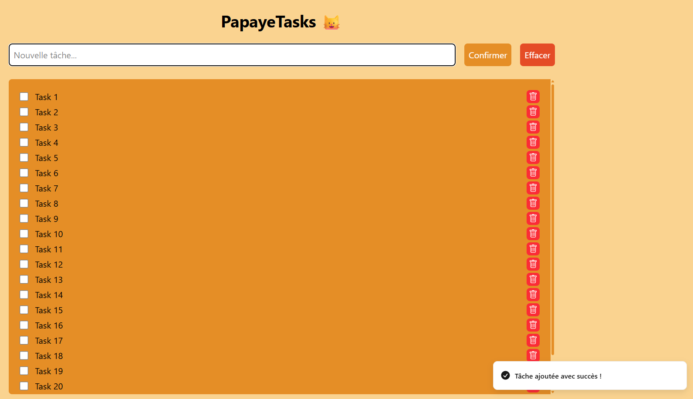

# PapayeTasks 🐈

## Explanation
Small To-do app made with :

- Bun as the runtime
- React as the frontend library
- Tailwind for the styling
- Zustand as the client store manager
- Vite as the build tool and development server
- Vitest for the tests
- LocalStorage for storing the data

## Demo

**Experience PapayeTasks in action:**  

Click the button above to try the app live!

Do a PR if any change is necessary ! :D